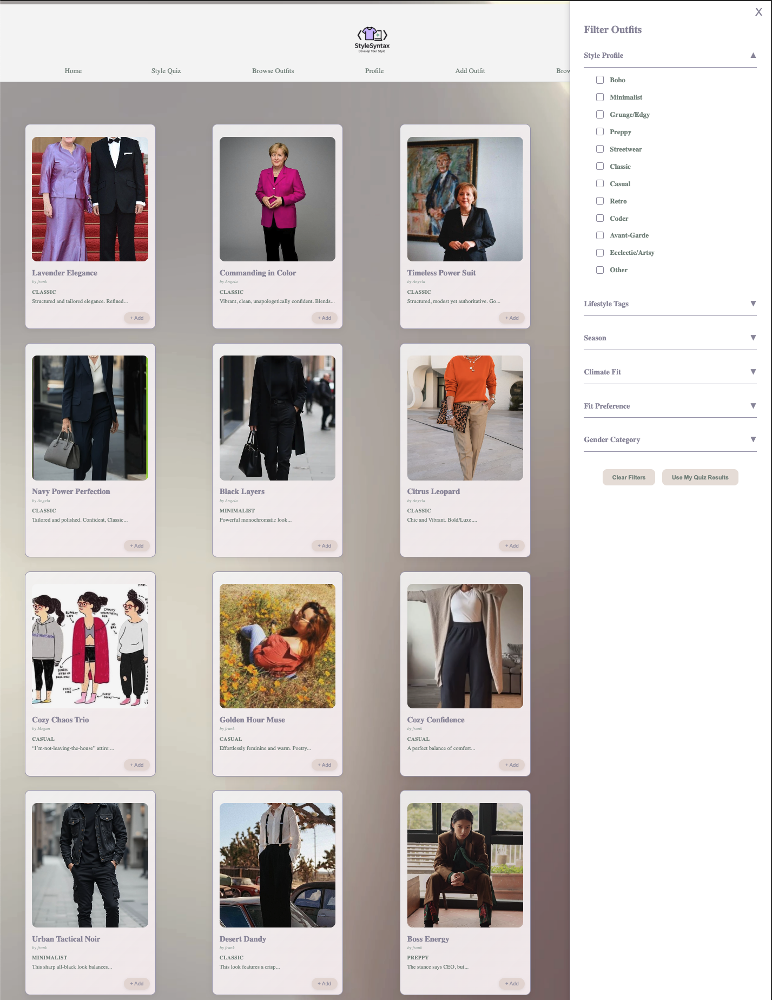
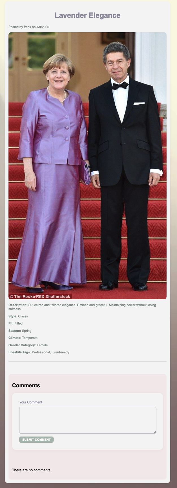

# Browse Outfits

On this page, a user can browse and filter styles uploaded by StyleSyntax users. Users can also add several outfits to their profile by clicking on the add button.

Browse Outfits Page

Clicking on an outfit card directs the user to the details of said outfit, where a user can view the style, fit, season, climate, gender category, and any tags associated with the style. Furthermore, a user can comment on the particular outfit by typing and submitting their comment in the comment box and clicking the "Submit Comment" button, respectively.

Example of Outfit Details Page
