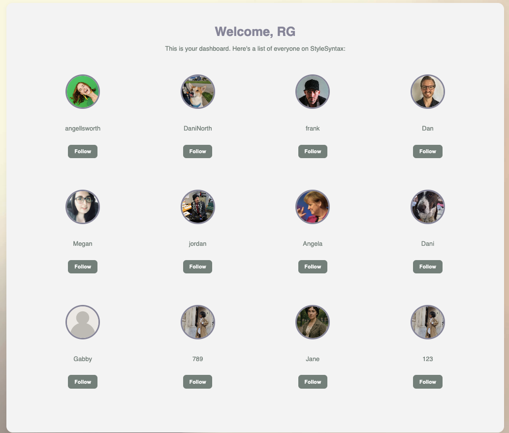

# Browse Users
Here, a user can browse and choose to follow other StyleSyntax users. By clicking on a card, the primary user can view a few details about another user, such as the other user's follower and following count.

Browse Users Page

Other Users Details
