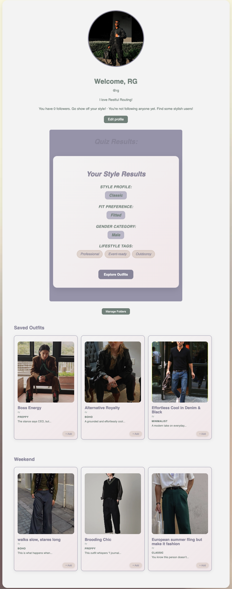
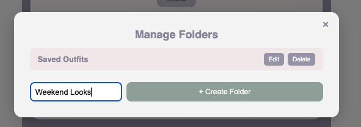

# Profile Page

## Description
Here is an example of the profile page. It contains a user's profile picture, an edit profile button, and the style quiz results. A user can explore outfits by pressing the "Explore Outfits" button at the bottom of their quiz results. Additionally, a user can create and edit style folders by clicking the "Manage Folders" button , and view the saved styles within the folders. 

